# PostgreSQL ERD — actual catalog

Generated from `docs/POSTGRES_SCHEMA_WITH_PAYMENTS.json` captured 2026-09-07T06:37:45.124Z.

24 business tables plus schema_migrations. PK/FK/UK describe actual constraints.
Parent participation uses column nullability; child maximum one is shown only for a full UNIQUE/PK on that FK.
Partial unique indexes remain conditional rules, not unconditional one-to-one cardinality.

```mermaid
erDiagram
  beds {
    uuid id PK,UK "required"
    uuid room_id FK,UK "required"
    text bed_number UK "required"
    text status "required"
    timestamp_with_time_zone created_at "required"
    timestamp_with_time_zone updated_at "required"
  }
  buildings {
    uuid id PK "required"
    text name "required"
    text address "nullable"
    text description "nullable"
    timestamp_with_time_zone created_at "required"
    timestamp_with_time_zone updated_at "required"
  }
  checkout_requests {
    uuid id PK "required"
    uuid student_id FK "required"
    uuid contract_id FK "required"
    uuid room_id FK "required"
    text reason "nullable"
    text status "required"
    uuid processed_by FK "nullable"
    timestamp_with_time_zone processed_at "nullable"
    text reject_reason "nullable"
    text cancel_reason "nullable"
    timestamp_with_time_zone created_at "required"
    timestamp_with_time_zone updated_at "required"
  }
  class_schedule_entries {
    uuid id PK "required"
    uuid schedule_id FK,UK "required"
    integer ordinal UK "required"
    text day_of_week "required"
    integer start_period "required"
    integer end_period "required"
  }
  class_schedules {
    uuid id PK "required"
    uuid student_id FK,UK "required"
    timestamp_with_time_zone created_at "required"
    timestamp_with_time_zone updated_at "required"
  }
  contracts {
    uuid id PK "required"
    uuid student_id FK "required"
    uuid bed_id FK "required"
    uuid room_id FK "required"
    timestamp_with_time_zone start_date "required"
    timestamp_with_time_zone end_date "required"
    text status "required"
    text reject_reason "nullable"
    text cancel_reason "nullable"
    uuid approved_by FK "nullable"
    timestamp_with_time_zone approved_at "nullable"
    timestamp_with_time_zone ended_at "nullable"
    timestamp_with_time_zone created_at "required"
    timestamp_with_time_zone updated_at "required"
  }
  equipment_categories {
    uuid id PK "required"
    text name "required"
    text unit "required"
    integer default_lifespan_months "nullable"
    timestamp_with_time_zone created_at "required"
    timestamp_with_time_zone updated_at "required"
  }
  equipment_items {
    uuid id PK "required"
    uuid category_id FK "required"
    uuid room_id FK "required"
    text serial_number UK "nullable"
    text condition "required"
    timestamp_with_time_zone purchase_date "nullable"
    numeric purchase_price "nullable"
    timestamp_with_time_zone created_at "required"
    timestamp_with_time_zone updated_at "required"
  }
  invoice_items {
    uuid id PK "required"
    uuid invoice_id FK,UK "required"
    text type UK "required"
    text description "required"
    numeric amount "required"
    text calculation_note "required"
    timestamp_with_time_zone created_at "required"
    timestamp_with_time_zone updated_at "required"
  }
  invoices {
    uuid id PK "required"
    uuid monthly_billing_id FK,UK "required"
    uuid student_id FK "required"
    uuid contract_id FK,UK "required"
    character_varying billing_period "required"
    text status "required"
    text building_name_snapshot "required"
    text room_number_snapshot "required"
    text student_full_name_snapshot "required"
    text mssv_snapshot "required"
    integer resident_days "required"
    integer days_in_month "required"
    numeric room_monthly_price "required"
    numeric room_fee "required"
    numeric electricity_share "required"
    numeric water_share "required"
    numeric wifi_share "required"
    numeric trash_share "required"
    numeric total_amount "required"
    timestamp_with_time_zone created_at "required"
    timestamp_with_time_zone updated_at "required"
  }
  maintenance_requests {
    uuid id PK "required"
    uuid student_id FK "required"
    uuid room_id FK "required"
    uuid equipment_item_id FK "nullable"
    text category "required"
    text description "required"
    text status "required"
    uuid assigned_staff_id FK "nullable"
    timestamp_with_time_zone processing_started_at "nullable"
    timestamp_with_time_zone resolved_at "nullable"
    text resolution_note "nullable"
    text resolution_method "nullable"
    text resolution_reason "nullable"
    numeric resolution_cost "nullable"
    text damage_cause "nullable"
    text damage_cause_detail "nullable"
    timestamp_with_time_zone cancelled_at "nullable"
    text cancel_reason "nullable"
    timestamp_with_time_zone created_at "required"
    timestamp_with_time_zone updated_at "required"
  }
  monthly_billings {
    uuid id PK "required"
    uuid room_id FK,UK "required"
    character_varying billing_period UK "required"
    text status "required"
    numeric draft_electricity_previous "required"
    numeric draft_electricity_current "required"
    numeric draft_water_previous "required"
    numeric draft_water_current "required"
    text building_name_snapshot "nullable"
    text room_number_snapshot "nullable"
    numeric electricity_previous "nullable"
    numeric electricity_current "nullable"
    numeric electricity_usage "nullable"
    numeric electricity_unit_price "nullable"
    numeric electricity_amount "nullable"
    numeric water_previous "nullable"
    numeric water_current "nullable"
    numeric water_usage "nullable"
    numeric water_unit_price "nullable"
    numeric water_amount "nullable"
    numeric wifi_fee "nullable"
    numeric trash_fee "nullable"
    numeric shared_service_total "nullable"
    numeric total_invoice_amount "nullable"
    uuid finalized_by FK "nullable"
    timestamp_with_time_zone finalized_at "nullable"
    uuid cancelled_by FK "nullable"
    timestamp_with_time_zone cancelled_at "nullable"
    text cancel_reason "nullable"
    timestamp_with_time_zone created_at "required"
    timestamp_with_time_zone updated_at "required"
  }
  notification_recipients {
    uuid id PK "required"
    uuid notification_id FK,UK "required"
    uuid student_id FK,UK "required"
    boolean is_read "required"
    timestamp_with_time_zone read_at "nullable"
    timestamp_with_time_zone created_at "required"
    timestamp_with_time_zone updated_at "required"
  }
  notifications {
    uuid id PK "required"
    text title "required"
    text content "required"
    text target_scope "required"
    uuid target_building_id FK "nullable"
    uuid target_student_id FK "nullable"
    uuid created_by FK "required"
    timestamp_with_time_zone created_at "required"
    timestamp_with_time_zone updated_at "required"
  }
  payments {
    uuid id PK "required"
    uuid invoice_id FK "required"
    numeric amount "required"
    text method "required"
    text status "required"
    text reference_code "nullable"
    text note "nullable"
    uuid submitted_by FK "required"
    uuid processed_by FK "nullable"
    timestamp_with_time_zone processed_at "nullable"
    text reject_reason "nullable"
    timestamp_with_time_zone cancelled_at "nullable"
    text cancel_reason "nullable"
    uuid voided_by FK "nullable"
    timestamp_with_time_zone voided_at "nullable"
    text void_reason "nullable"
    timestamp_with_time_zone created_at "required"
    timestamp_with_time_zone updated_at "required"
  }
  room_billing_cursors {
    uuid room_id PK,FK "required"
    character_varying latest_finalized_billing_period "nullable"
    integer version "required"
    timestamp_with_time_zone created_at "required"
    timestamp_with_time_zone updated_at "required"
  }
  room_change_requests {
    uuid id PK "required"
    uuid student_id FK "required"
    uuid current_contract_id FK "required"
    uuid target_bed_id FK "required"
    text reason "nullable"
    text status "required"
    uuid processed_by FK "nullable"
    timestamp_with_time_zone processed_at "nullable"
    text reject_reason "nullable"
    timestamp_with_time_zone created_at "required"
    timestamp_with_time_zone updated_at "required"
  }
  room_preferences {
    uuid id PK "required"
    uuid student_id FK,UK "required"
    text price_preference "nullable"
    boolean wants_hot_water "nullable"
    text occupancy_preference "nullable"
    timestamp_with_time_zone created_at "required"
    timestamp_with_time_zone updated_at "required"
  }
  room_types {
    uuid id PK "required"
    text name "required"
    integer capacity "required"
    numeric price_per_month "required"
    text description "nullable"
    timestamp_with_time_zone created_at "required"
    timestamp_with_time_zone updated_at "required"
  }
  rooms {
    uuid id PK "required"
    uuid building_id FK,UK "required"
    uuid room_type_id FK "required"
    text room_number UK "required"
    integer floor "required"
    text status "required"
    timestamp_with_time_zone created_at "required"
    timestamp_with_time_zone updated_at "required"
  }
  staff {
    uuid id PK "required"
    uuid user_id FK,UK "required"
    text position "required"
    timestamp_with_time_zone created_at "required"
    timestamp_with_time_zone updated_at "required"
  }
  students {
    uuid id PK "required"
    uuid user_id FK,UK "required"
    text mssv UK "required"
    text class_name "nullable"
    text faculty "nullable"
    text gender "nullable"
    timestamp_with_time_zone dob "nullable"
    text cccd "nullable"
    text permanent_address "nullable"
    text emergency_contact_name "nullable"
    text emergency_contact_phone "nullable"
    timestamp_with_time_zone created_at "required"
    timestamp_with_time_zone updated_at "required"
  }
  users {
    uuid id PK "required"
    text username UK "required"
    text password_hash "required"
    text role "required"
    text full_name "required"
    text email UK "nullable"
    text phone "nullable"
    text avatar_url "nullable"
    text status "required"
    timestamp_with_time_zone created_at "required"
    timestamp_with_time_zone updated_at "required"
  }
  utility_readings {
    uuid id PK "required"
    uuid room_id FK,UK "required"
    character_varying billing_period UK "required"
    numeric electricity_previous "required"
    numeric electricity_current "required"
    numeric electricity_usage "required"
    numeric electricity_unit_price "required"
    numeric electricity_amount "required"
    numeric water_previous "required"
    numeric water_current "required"
    numeric water_usage "required"
    numeric water_unit_price "required"
    numeric water_amount "required"
    uuid recorded_by FK "required"
    timestamp_with_time_zone created_at "required"
    timestamp_with_time_zone updated_at "required"
    uuid monthly_billing_id FK,UK "required"
  }
  rooms ||--o{ beds : "room_id"
  contracts ||--o{ checkout_requests : "contract_id"
  users |o--o{ checkout_requests : "processed_by"
  rooms ||--o{ checkout_requests : "room_id"
  students ||--o{ checkout_requests : "student_id"
  class_schedules ||--o{ class_schedule_entries : "schedule_id"
  students ||--o| class_schedules : "student_id"
  users |o--o{ contracts : "approved_by"
  beds ||--o{ contracts : "bed_id+room_id"
  rooms ||--o{ contracts : "room_id"
  students ||--o{ contracts : "student_id"
  equipment_categories ||--o{ equipment_items : "category_id"
  rooms ||--o{ equipment_items : "room_id"
  invoices ||--o{ invoice_items : "invoice_id"
  contracts ||--o{ invoices : "contract_id"
  monthly_billings ||--o{ invoices : "monthly_billing_id"
  students ||--o{ invoices : "student_id"
  staff |o--o{ maintenance_requests : "assigned_staff_id"
  equipment_items |o--o{ maintenance_requests : "equipment_item_id"
  rooms ||--o{ maintenance_requests : "room_id"
  students ||--o{ maintenance_requests : "student_id"
  users |o--o{ monthly_billings : "cancelled_by"
  users |o--o{ monthly_billings : "finalized_by"
  rooms ||--o{ monthly_billings : "room_id"
  notifications ||--o{ notification_recipients : "notification_id"
  students ||--o{ notification_recipients : "student_id"
  users ||--o{ notifications : "created_by"
  buildings |o--o{ notifications : "target_building_id"
  students |o--o{ notifications : "target_student_id"
  invoices ||--o{ payments : "invoice_id"
  users |o--o{ payments : "processed_by"
  users ||--o{ payments : "submitted_by"
  users |o--o{ payments : "voided_by"
  rooms ||--o| room_billing_cursors : "room_id"
  contracts ||--o{ room_change_requests : "current_contract_id"
  users |o--o{ room_change_requests : "processed_by"
  students ||--o{ room_change_requests : "student_id"
  beds ||--o{ room_change_requests : "target_bed_id"
  students ||--o| room_preferences : "student_id"
  buildings ||--o{ rooms : "building_id"
  room_types ||--o{ rooms : "room_type_id"
  users ||--o| staff : "user_id"
  users ||--o| students : "user_id"
  monthly_billings ||--o| utility_readings : "monthly_billing_id"
  users ||--o{ utility_readings : "recorded_by"
  rooms ||--o{ utility_readings : "room_id"
```

## Actual foreign keys and deletion policies

|Constraint|Relation|Definition|
|---|---|---|
|fk_beds_room|beds.room_id → rooms.id|FOREIGN KEY (room_id) REFERENCES rooms(id) ON DELETE RESTRICT|
|fk_checkout_requests_contract|checkout_requests.contract_id → contracts.id|FOREIGN KEY (contract_id) REFERENCES contracts(id) ON DELETE RESTRICT|
|fk_checkout_requests_processed_by|checkout_requests.processed_by → users.id|FOREIGN KEY (processed_by) REFERENCES users(id) ON DELETE RESTRICT|
|fk_checkout_requests_room|checkout_requests.room_id → rooms.id|FOREIGN KEY (room_id) REFERENCES rooms(id) ON DELETE RESTRICT|
|fk_checkout_requests_student|checkout_requests.student_id → students.id|FOREIGN KEY (student_id) REFERENCES students(id) ON DELETE RESTRICT|
|fk_class_schedule_entries_schedule|class_schedule_entries.schedule_id → class_schedules.id|FOREIGN KEY (schedule_id) REFERENCES class_schedules(id) ON DELETE CASCADE|
|fk_class_schedules_student|class_schedules.student_id → students.id|FOREIGN KEY (student_id) REFERENCES students(id) ON DELETE RESTRICT|
|fk_contracts_approved_by|contracts.approved_by → users.id|FOREIGN KEY (approved_by) REFERENCES users(id) ON DELETE RESTRICT|
|fk_contracts_bed_room|contracts.bed_id+room_id → beds.id+room_id|FOREIGN KEY (bed_id, room_id) REFERENCES beds(id, room_id) ON DELETE RESTRICT|
|fk_contracts_room|contracts.room_id → rooms.id|FOREIGN KEY (room_id) REFERENCES rooms(id) ON DELETE RESTRICT|
|fk_contracts_student|contracts.student_id → students.id|FOREIGN KEY (student_id) REFERENCES students(id) ON DELETE RESTRICT|
|fk_equipment_items_category|equipment_items.category_id → equipment_categories.id|FOREIGN KEY (category_id) REFERENCES equipment_categories(id) ON DELETE RESTRICT|
|fk_equipment_items_room|equipment_items.room_id → rooms.id|FOREIGN KEY (room_id) REFERENCES rooms(id) ON DELETE RESTRICT|
|fk_invoice_items_invoice|invoice_items.invoice_id → invoices.id|FOREIGN KEY (invoice_id) REFERENCES invoices(id) ON DELETE CASCADE|
|fk_invoices_contract|invoices.contract_id → contracts.id|FOREIGN KEY (contract_id) REFERENCES contracts(id) ON DELETE RESTRICT|
|fk_invoices_monthly_billing|invoices.monthly_billing_id → monthly_billings.id|FOREIGN KEY (monthly_billing_id) REFERENCES monthly_billings(id) ON DELETE RESTRICT|
|fk_invoices_student|invoices.student_id → students.id|FOREIGN KEY (student_id) REFERENCES students(id) ON DELETE RESTRICT|
|fk_maintenance_requests_assigned_staff|maintenance_requests.assigned_staff_id → staff.id|FOREIGN KEY (assigned_staff_id) REFERENCES staff(id) ON DELETE RESTRICT|
|fk_maintenance_requests_equipment_item|maintenance_requests.equipment_item_id → equipment_items.id|FOREIGN KEY (equipment_item_id) REFERENCES equipment_items(id) ON DELETE RESTRICT|
|fk_maintenance_requests_room|maintenance_requests.room_id → rooms.id|FOREIGN KEY (room_id) REFERENCES rooms(id) ON DELETE RESTRICT|
|fk_maintenance_requests_student|maintenance_requests.student_id → students.id|FOREIGN KEY (student_id) REFERENCES students(id) ON DELETE RESTRICT|
|fk_monthly_billings_cancelled_by|monthly_billings.cancelled_by → users.id|FOREIGN KEY (cancelled_by) REFERENCES users(id) ON DELETE RESTRICT|
|fk_monthly_billings_finalized_by|monthly_billings.finalized_by → users.id|FOREIGN KEY (finalized_by) REFERENCES users(id) ON DELETE RESTRICT|
|fk_monthly_billings_room|monthly_billings.room_id → rooms.id|FOREIGN KEY (room_id) REFERENCES rooms(id) ON DELETE RESTRICT|
|fk_notification_recipients_notification|notification_recipients.notification_id → notifications.id|FOREIGN KEY (notification_id) REFERENCES notifications(id) ON DELETE CASCADE|
|fk_notification_recipients_student|notification_recipients.student_id → students.id|FOREIGN KEY (student_id) REFERENCES students(id) ON DELETE RESTRICT|
|fk_notifications_created_by|notifications.created_by → users.id|FOREIGN KEY (created_by) REFERENCES users(id) ON DELETE RESTRICT|
|fk_notifications_target_building|notifications.target_building_id → buildings.id|FOREIGN KEY (target_building_id) REFERENCES buildings(id) ON DELETE RESTRICT|
|fk_notifications_target_student|notifications.target_student_id → students.id|FOREIGN KEY (target_student_id) REFERENCES students(id) ON DELETE RESTRICT|
|fk_payments_invoice|payments.invoice_id → invoices.id|FOREIGN KEY (invoice_id) REFERENCES invoices(id) ON DELETE RESTRICT|
|fk_payments_processed_by|payments.processed_by → users.id|FOREIGN KEY (processed_by) REFERENCES users(id) ON DELETE RESTRICT|
|fk_payments_submitted_by|payments.submitted_by → users.id|FOREIGN KEY (submitted_by) REFERENCES users(id) ON DELETE RESTRICT|
|fk_payments_voided_by|payments.voided_by → users.id|FOREIGN KEY (voided_by) REFERENCES users(id) ON DELETE RESTRICT|
|fk_room_billing_cursors_room|room_billing_cursors.room_id → rooms.id|FOREIGN KEY (room_id) REFERENCES rooms(id) ON DELETE CASCADE|
|fk_room_change_requests_current_contract|room_change_requests.current_contract_id → contracts.id|FOREIGN KEY (current_contract_id) REFERENCES contracts(id) ON DELETE RESTRICT|
|fk_room_change_requests_processed_by|room_change_requests.processed_by → users.id|FOREIGN KEY (processed_by) REFERENCES users(id) ON DELETE RESTRICT|
|fk_room_change_requests_student|room_change_requests.student_id → students.id|FOREIGN KEY (student_id) REFERENCES students(id) ON DELETE RESTRICT|
|fk_room_change_requests_target_bed|room_change_requests.target_bed_id → beds.id|FOREIGN KEY (target_bed_id) REFERENCES beds(id) ON DELETE RESTRICT|
|fk_room_preferences_student|room_preferences.student_id → students.id|FOREIGN KEY (student_id) REFERENCES students(id) ON DELETE RESTRICT|
|fk_rooms_building|rooms.building_id → buildings.id|FOREIGN KEY (building_id) REFERENCES buildings(id) ON DELETE RESTRICT|
|fk_rooms_room_type|rooms.room_type_id → room_types.id|FOREIGN KEY (room_type_id) REFERENCES room_types(id) ON DELETE RESTRICT|
|fk_staff_user|staff.user_id → users.id|FOREIGN KEY (user_id) REFERENCES users(id) ON DELETE RESTRICT|
|fk_students_user|students.user_id → users.id|FOREIGN KEY (user_id) REFERENCES users(id) ON DELETE RESTRICT|
|fk_utility_readings_monthly_billing|utility_readings.monthly_billing_id → monthly_billings.id|FOREIGN KEY (monthly_billing_id) REFERENCES monthly_billings(id) ON DELETE RESTRICT|
|fk_utility_readings_recorded_by|utility_readings.recorded_by → users.id|FOREIGN KEY (recorded_by) REFERENCES users(id) ON DELETE RESTRICT|
|fk_utility_readings_room|utility_readings.room_id → rooms.id|FOREIGN KEY (room_id) REFERENCES rooms(id) ON DELETE RESTRICT|

## Actual indexes (including partial unique rules)

|Table|Name|Definition|
|---|---|---|
|beds|ix_beds_room_status|CREATE INDEX ix_beds_room_status ON public.beds USING btree (room_id, status)|
|beds|pk_beds|CREATE UNIQUE INDEX pk_beds ON public.beds USING btree (id)|
|beds|uq_beds_id_room|CREATE UNIQUE INDEX uq_beds_id_room ON public.beds USING btree (id, room_id)|
|beds|uq_beds_room_bed_number|CREATE UNIQUE INDEX uq_beds_room_bed_number ON public.beds USING btree (room_id, bed_number)|
|buildings|pk_buildings|CREATE UNIQUE INDEX pk_buildings ON public.buildings USING btree (id)|
|checkout_requests|ix_checkout_requests_contract_id_status|CREATE INDEX ix_checkout_requests_contract_id_status ON public.checkout_requests USING btree (contract_id, status)|
|checkout_requests|ix_checkout_requests_room_id_status_created_at|CREATE INDEX ix_checkout_requests_room_id_status_created_at ON public.checkout_requests USING btree (room_id, status, created_at DESC)|
|checkout_requests|ix_checkout_requests_student_id_status_created_at|CREATE INDEX ix_checkout_requests_student_id_status_created_at ON public.checkout_requests USING btree (student_id, status, created_at DESC)|
|checkout_requests|pk_checkout_requests|CREATE UNIQUE INDEX pk_checkout_requests ON public.checkout_requests USING btree (id)|
|checkout_requests|uq_checkout_requests_pending_student|CREATE UNIQUE INDEX uq_checkout_requests_pending_student ON public.checkout_requests USING btree (student_id) WHERE (status = 'PENDING'::text)|
|class_schedule_entries|pk_class_schedule_entries|CREATE UNIQUE INDEX pk_class_schedule_entries ON public.class_schedule_entries USING btree (id)|
|class_schedule_entries|uq_class_schedule_entries_order|CREATE UNIQUE INDEX uq_class_schedule_entries_order ON public.class_schedule_entries USING btree (schedule_id, ordinal)|
|class_schedules|pk_class_schedules|CREATE UNIQUE INDEX pk_class_schedules ON public.class_schedules USING btree (id)|
|class_schedules|uq_class_schedules_student_id|CREATE UNIQUE INDEX uq_class_schedules_student_id ON public.class_schedules USING btree (student_id)|
|contracts|ix_contracts_bed_id_status|CREATE INDEX ix_contracts_bed_id_status ON public.contracts USING btree (bed_id, status)|
|contracts|ix_contracts_room_id_status|CREATE INDEX ix_contracts_room_id_status ON public.contracts USING btree (room_id, status)|
|contracts|ix_contracts_student_id_status|CREATE INDEX ix_contracts_student_id_status ON public.contracts USING btree (student_id, status)|
|contracts|pk_contracts|CREATE UNIQUE INDEX pk_contracts ON public.contracts USING btree (id)|
|contracts|uq_contracts_active_bed|CREATE UNIQUE INDEX uq_contracts_active_bed ON public.contracts USING btree (bed_id) WHERE (status = 'ACTIVE'::text)|
|contracts|uq_contracts_open_student|CREATE UNIQUE INDEX uq_contracts_open_student ON public.contracts USING btree (student_id) WHERE (status = ANY (ARRAY['PENDING'::text, 'ACTIVE'::text]))|
|equipment_categories|pk_equipment_categories|CREATE UNIQUE INDEX pk_equipment_categories ON public.equipment_categories USING btree (id)|
|equipment_items|ix_equipment_items_category|CREATE INDEX ix_equipment_items_category ON public.equipment_items USING btree (category_id)|
|equipment_items|ix_equipment_items_room|CREATE INDEX ix_equipment_items_room ON public.equipment_items USING btree (room_id)|
|equipment_items|pk_equipment_items|CREATE UNIQUE INDEX pk_equipment_items ON public.equipment_items USING btree (id)|
|equipment_items|uq_equipment_items_serial_number|CREATE UNIQUE INDEX uq_equipment_items_serial_number ON public.equipment_items USING btree (serial_number)|
|invoice_items|pk_invoice_items|CREATE UNIQUE INDEX pk_invoice_items ON public.invoice_items USING btree (id)|
|invoice_items|uq_invoice_items_invoice_id_type|CREATE UNIQUE INDEX uq_invoice_items_invoice_id_type ON public.invoice_items USING btree (invoice_id, type)|
|invoices|ix_invoices_student_id_billing_period|CREATE INDEX ix_invoices_student_id_billing_period ON public.invoices USING btree (student_id, billing_period DESC)|
|invoices|pk_invoices|CREATE UNIQUE INDEX pk_invoices ON public.invoices USING btree (id)|
|invoices|uq_invoices_monthly_billing_id_contract_id|CREATE UNIQUE INDEX uq_invoices_monthly_billing_id_contract_id ON public.invoices USING btree (monthly_billing_id, contract_id)|
|maintenance_requests|ix_maintenance_requests_assigned_staff_id_status|CREATE INDEX ix_maintenance_requests_assigned_staff_id_status ON public.maintenance_requests USING btree (assigned_staff_id, status)|
|maintenance_requests|ix_maintenance_requests_room_id_status_created_at|CREATE INDEX ix_maintenance_requests_room_id_status_created_at ON public.maintenance_requests USING btree (room_id, status, created_at DESC)|
|maintenance_requests|ix_maintenance_requests_student_id_status_created_at|CREATE INDEX ix_maintenance_requests_student_id_status_created_at ON public.maintenance_requests USING btree (student_id, status, created_at DESC)|
|maintenance_requests|pk_maintenance_requests|CREATE UNIQUE INDEX pk_maintenance_requests ON public.maintenance_requests USING btree (id)|
|monthly_billings|ix_monthly_billings_period|CREATE INDEX ix_monthly_billings_period ON public.monthly_billings USING btree (billing_period DESC)|
|monthly_billings|pk_monthly_billings|CREATE UNIQUE INDEX pk_monthly_billings ON public.monthly_billings USING btree (id)|
|monthly_billings|uq_monthly_billings_room_period|CREATE UNIQUE INDEX uq_monthly_billings_room_period ON public.monthly_billings USING btree (room_id, billing_period)|
|notification_recipients|ix_notification_recipients_student_id_is_read_created_at|CREATE INDEX ix_notification_recipients_student_id_is_read_created_at ON public.notification_recipients USING btree (student_id, is_read, created_at DESC)|
|notification_recipients|pk_notification_recipients|CREATE UNIQUE INDEX pk_notification_recipients ON public.notification_recipients USING btree (id)|
|notification_recipients|uq_notification_recipients_notification_id_student_id|CREATE UNIQUE INDEX uq_notification_recipients_notification_id_student_id ON public.notification_recipients USING btree (notification_id, student_id)|
|notifications|ix_notifications_created_at|CREATE INDEX ix_notifications_created_at ON public.notifications USING btree (created_at DESC)|
|notifications|ix_notifications_target_scope_created_at|CREATE INDEX ix_notifications_target_scope_created_at ON public.notifications USING btree (target_scope, created_at DESC)|
|notifications|pk_notifications|CREATE UNIQUE INDEX pk_notifications ON public.notifications USING btree (id)|
|payments|ix_payments_invoice|CREATE INDEX ix_payments_invoice ON public.payments USING btree (invoice_id)|
|payments|ix_payments_status_created|CREATE INDEX ix_payments_status_created ON public.payments USING btree (status, created_at DESC, id)|
|payments|ix_payments_submitted_created|CREATE INDEX ix_payments_submitted_created ON public.payments USING btree (submitted_by, created_at DESC, id)|
|payments|pk_payments|CREATE UNIQUE INDEX pk_payments ON public.payments USING btree (id)|
|payments|uq_payments_pending_invoice|CREATE UNIQUE INDEX uq_payments_pending_invoice ON public.payments USING btree (invoice_id) WHERE (status = 'PENDING'::text)|
|room_billing_cursors|pk_room_billing_cursors|CREATE UNIQUE INDEX pk_room_billing_cursors ON public.room_billing_cursors USING btree (room_id)|
|room_change_requests|ix_room_change_requests_status_created_at|CREATE INDEX ix_room_change_requests_status_created_at ON public.room_change_requests USING btree (status, created_at DESC)|
|room_change_requests|ix_room_change_requests_student_id_status|CREATE INDEX ix_room_change_requests_student_id_status ON public.room_change_requests USING btree (student_id, status)|
|room_change_requests|pk_room_change_requests|CREATE UNIQUE INDEX pk_room_change_requests ON public.room_change_requests USING btree (id)|
|room_change_requests|uq_room_change_requests_pending_student|CREATE UNIQUE INDEX uq_room_change_requests_pending_student ON public.room_change_requests USING btree (student_id) WHERE (status = 'PENDING'::text)|
|room_preferences|pk_room_preferences|CREATE UNIQUE INDEX pk_room_preferences ON public.room_preferences USING btree (id)|
|room_preferences|uq_room_preferences_student_id|CREATE UNIQUE INDEX uq_room_preferences_student_id ON public.room_preferences USING btree (student_id)|
|room_types|pk_room_types|CREATE UNIQUE INDEX pk_room_types ON public.room_types USING btree (id)|
|rooms|ix_rooms_building_floor_number|CREATE INDEX ix_rooms_building_floor_number ON public.rooms USING btree (building_id, floor, room_number)|
|rooms|ix_rooms_room_type|CREATE INDEX ix_rooms_room_type ON public.rooms USING btree (room_type_id)|
|rooms|pk_rooms|CREATE UNIQUE INDEX pk_rooms ON public.rooms USING btree (id)|
|rooms|uq_rooms_building_room_number|CREATE UNIQUE INDEX uq_rooms_building_room_number ON public.rooms USING btree (building_id, room_number)|
|schema_migrations|pk_schema_migrations|CREATE UNIQUE INDEX pk_schema_migrations ON public.schema_migrations USING btree (version)|
|staff|pk_staff|CREATE UNIQUE INDEX pk_staff ON public.staff USING btree (id)|
|staff|uq_staff_user_id|CREATE UNIQUE INDEX uq_staff_user_id ON public.staff USING btree (user_id)|
|students|pk_students|CREATE UNIQUE INDEX pk_students ON public.students USING btree (id)|
|students|uq_students_mssv|CREATE UNIQUE INDEX uq_students_mssv ON public.students USING btree (mssv)|
|students|uq_students_user_id|CREATE UNIQUE INDEX uq_students_user_id ON public.students USING btree (user_id)|
|users|pk_users|CREATE UNIQUE INDEX pk_users ON public.users USING btree (id)|
|users|uq_users_email|CREATE UNIQUE INDEX uq_users_email ON public.users USING btree (email)|
|users|uq_users_username|CREATE UNIQUE INDEX uq_users_username ON public.users USING btree (username)|
|utility_readings|pk_utility_readings|CREATE UNIQUE INDEX pk_utility_readings ON public.utility_readings USING btree (id)|
|utility_readings|uq_utility_readings_monthly_billing|CREATE UNIQUE INDEX uq_utility_readings_monthly_billing ON public.utility_readings USING btree (monthly_billing_id)|
|utility_readings|uq_utility_readings_room_period|CREATE UNIQUE INDEX uq_utility_readings_room_period ON public.utility_readings USING btree (room_id, billing_period)|
